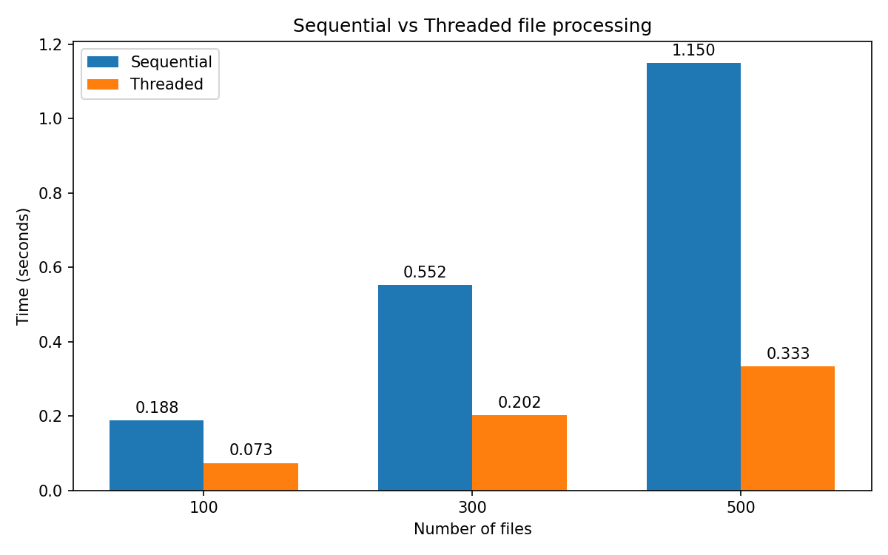

# Лабораторна робота №1 — Робота з файловою системою Linux та багатопоточне читання файлів засобами Python

**Дисципліна:** Операційні системи та системне програмування
**Студент:** Кусік
**Рік:** 2026

---

## МЕТА РОБОТИ

Ознайомитися зі структурою файлової системи Linux та механізмами прав доступу. Реалізувати послідовну та багатопоточну обробку файлів засобами Python, виміряти та порівняти їх продуктивність.

---

## ОПИС ДАТАСЕТУ

Тестові дані генеруються програмно: текстові файли з випадковим вмістом (слова з фіксованого словника) по **1000 рядків** кожен.
Кількість файлів для трьох експериментів: **100**, **300**, **500**.
Файли зберігаються у каталозі `lab_os_1/input/`.

---

## ПІДГОТОВКА ДАНИХ

Програма створює таку структуру каталогів:

```
lab_os_1/
├── input/    (chmod 755) — вхідні текстові файли
├── output/   (chmod 755) — результати аналізу
└── logs/     (chmod 700) — системні логи
```

Права доступу встановлюються через `os.chmod()` у форматі POSIX (octal).

---

## ОПИС МОДЕЛЕЙ

### Послідовна обробка (Sequential)
Файли з `input/` зчитуються по черзі в одному потоці. Для кожного файлу обчислюється кількість рядків, слів і символів. Результати записуються у `output/result_sequential.txt`.

### Багатопоточна обробка (Threaded)
Для кожного файлу створюється окремий потік (`threading.Thread`). Запис результатів у спільний список захищено `threading.Lock()`. Результати записуються у `output/result_threads.txt`.

---

## РЕЗУЛЬТАТИ ЕКСПЕРИМЕНТІВ

| Кількість файлів | Sequential (сек.) | Threaded (сек.) |
|:---:|:---:|:---:|
| 100 | — | — |
| 300 | — | — |
| 500 | — | — |

> Таблиця заповнюється після запуску notebook.



---

## АНАЛІЗ РЕЗУЛЬТАТІВ

Багатопоточна обробка дозволяє виконувати читання файлів паралельно, що теоретично має прискорити роботу при великій кількості файлів. Однак через наявність GIL (Global Interpreter Lock) у CPython реальний приріст швидкості при IO-операціях залежить від конфігурації системи. На операціях читання з диску threading дає помітну перевагу, оскільки потоки можуть чекати на IO незалежно один від одного.

---

## ВИСНОВКИ

У ході лабораторної роботи:
- Реалізовано створення структури каталогів з правами доступу POSIX (755/700).
- Написано генератор тестових файлів із випадковим вмістом.
- Реалізовано послідовну та багатопоточну версії аналізу файлів.
- Виміряно та порівняно час виконання для 100, 300 і 500 файлів.

Багатопоточність є ефективним інструментом для IO-bound задач: при збільшенні кількості файлів різниця між послідовним та паралельним підходами стає більш вираженою на користь threading.
