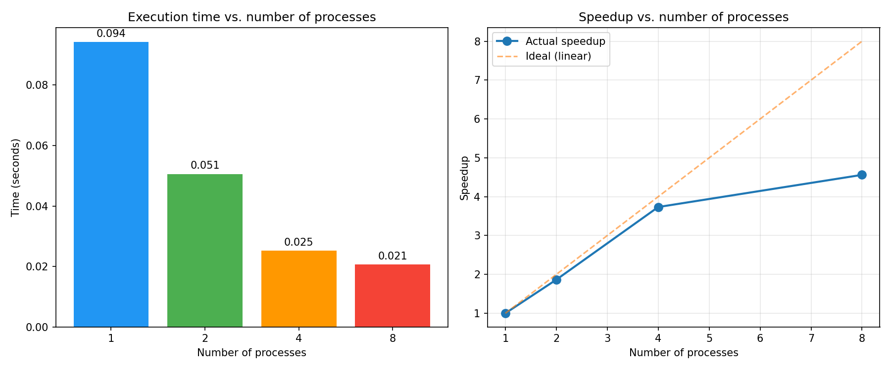

# Лабораторна робота №2 — Реалізація CPU-інтенсивної задачі: пошук простих чисел засобами Python

**Дисципліна:** Операційні системи та системне програмування  
**Студент:** Кусік  
**Рік:** 2026

---

## МЕТА РОБОТИ

Вивчити механізми керування процесами в операційній системі Linux. Опанувати модуль `multiprocessing` мови Python для паралельних обчислень. Реалізувати CPU-інтенсивну задачу — пошук простих чисел методом пробного ділення — та порівняти ефективність послідовного і багатопроцесорного виконання.

---

## ОПИС ДАТАСЕТУ

Вхідні дані генеруються програмно: **50 000 випадкових цілих чисел** у діапазоні від **10 000 до 10 000 000**, отриманих через `random.sample` (без повторень, `RANDOM_STATE = 42`). Числа зберігаються у файлі `lab_os_2/input/numbers.txt`, по одному на рядок.

---

## ПІДГОТОВКА ДАНИХ

Програма створює таку структуру каталогів:

```
lab_os_2/
├── input/    (chmod 755) — вхідний файл numbers.txt
├── output/   (chmod 755) — результати пошуку простих чисел
└── logs/     (chmod 700) — журнал вимірювань timing.log
```

Права доступу встановлюються через `os.chmod()` у форматі POSIX (octal). Генерація чисел — `random.sample(range(10_000, 10_000_001), 10_000)` з фіксованим `RANDOM_STATE = 42`.

---

## ОПИС МОДЕЛЕЙ

### Функція перевірки простоти

Метод **пробного ділення** (trial division): для числа `n` перевіряються всі непарні дільники від 3 до `√n`. Складність — O(√n) на одне число.

### Послідовна обробка (Sequential, 1 процес)

Числа з `input/numbers.txt` перевіряються по черзі в одному процесі. Результати записуються у `output/result_sequential.txt`.

### Багатопроцесорна обробка (multiprocessing.Pool)

Список чисел передається у `Pool.map(is_prime, numbers)`. Пул автоматично розбиває список на чанки та розподіляє роботу між `n` процесами (2, 4, 8). Кожен варіант записує результат у `output/result_pool_N.txt`.

---

## РЕЗУЛЬТАТИ ЕКСПЕРИМЕНТІВ

| Кількість процесів | Час (сек.) | Прискорення |
|:---:|:---:|:---:|
| 1 (sequential) | 0.0943 | 1.00× |
| 2 | 0.0506 | 1.86× |
| 4 | 0.0253 | 3.73× |
| 8 | 0.0207 | 4.56× |

Знайдено простих чисел: **3 714** з 50 000.  
Детальний лог — `lab_os_2/logs/timing.log`.



---

## АНАЛІЗ РЕЗУЛЬТАТІВ

Задача пошуку простих чисел є **CPU-bound**: кожне число перевіряється незалежно від інших, що робить її ідеально придатною для розпаралелювання. `multiprocessing` обходить GIL через окремі процеси, на відміну від `threading`.

Результати демонструють стійке зростання продуктивності зі збільшенням кількості процесів. При `workers=2` прискорення склало **1.86×** (майже вдвічі), при `workers=4` — **3.73×**, при `workers=8` — **4.56×**. Прискорення є суттєвим, але не лінійним: ідеально для 8 процесів було б 8×, натомість отримано 4.56×. Це пояснюється **законом Амдала**: фіксовані накладні витрати (серіалізація аргументів через pickle, IPC між процесами, збір результатів) не піддаються розпаралелюванню. Зі збільшенням числа процесів ці витрати стають відносно більшими, через що приріст прискорення від 4 до 8 процесів (3.73× → 4.56×) менший, ніж від 1 до 2 (1.00× → 1.86×).

---

## ВИСНОВКИ

У ході лабораторної роботи:
- Реалізовано створення структури каталогів з правами доступу POSIX (755/700).
- Написано генератор 50 000 випадкових чисел у діапазоні [10 000, 10 000 000]; знайдено 3 714 простих числа.
- Реалізовано послідовну та багатопроцесорну (Pool.map) версії пошуку простих чисел.
- Виміряно час виконання для 1, 2, 4 і 8 процесів та обчислено прискорення (best-of-3 для кожної конфігурації).

`multiprocessing.Pool` є ефективним інструментом для CPU-bound задач: він обходить GIL і дає реальне прискорення на всіх конфігураціях (1.86×–4.56×). Реальне прискорення менше ідеального через накладні витрати серіалізації та IPC, що відповідає закону Амдала. Найкращий результат отримано при 8 процесах (0.0207 с проти 0.0943 с послідовно).
