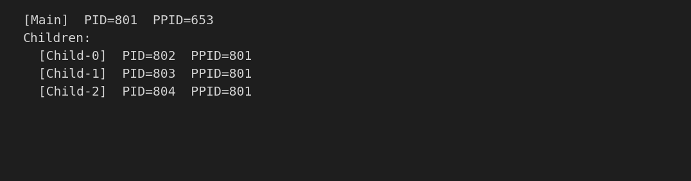
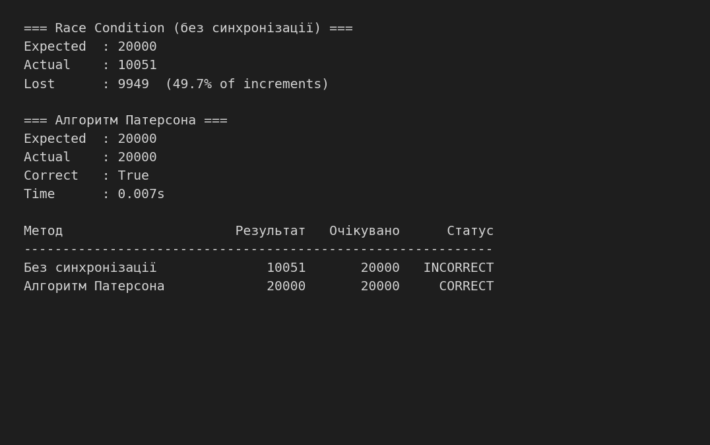
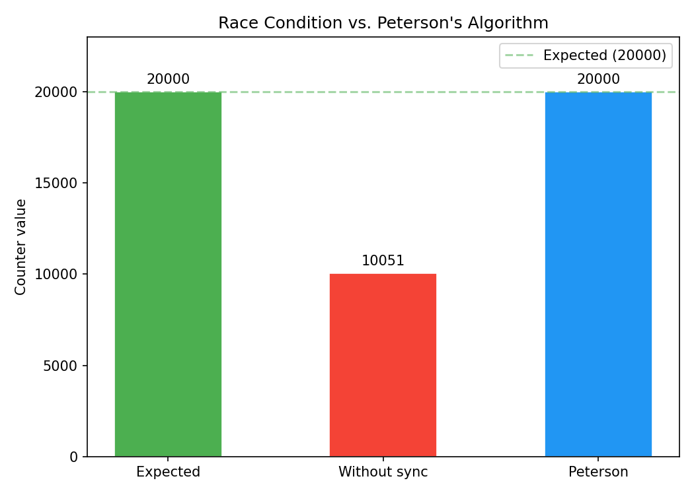

# Лабораторна робота №3 — Керування процесами та програмна синхронізація (Алгоритм Патерсона)

**Дисципліна:** Операційні системи та системне програмування  
**Студент:** Кусік  
**Рік:** 2026

---

## МЕТА РОБОТИ

Вивчити механізми керування процесами в Linux: отримання ідентифікаторів PID/PPID, ієрархію процесів, поведінку планувальника ОС. Реалізувати та дослідити проблему взаємного виключення (race condition) і класичне програмне рішення — алгоритм Патерсона — засобами модулів `os` та `multiprocessing` мови Python.

---

## ОПИС ДАТАСЕТУ

Спільний ресурс — цілочисельний лічильник `multiprocessing.Value('i', lock=False)`. Два паралельних процеси кожен виконують **10 000 інкрементів** — разом очікуваний результат **20 000**. Без синхронізації кінцеве значення менше за 20 000 через втрати при одночасному доступі. З алгоритмом Патерсона результат має бути рівно 20 000.

---

## ПІДГОТОВКА ДАНИХ

Програма створює структуру каталогів:

```
lab_os_3/
├── input/    (chmod 755)
├── output/   (chmod 755)
└── logs/     (chmod 700) — results.log із підсумком вимірювань
```

Спільні змінні ініціалізуються через `multiprocessing.Value` та `multiprocessing.Array` — ядро ОС надає спільний сегмент пам'яті, доступний усім дочірнім процесам через `fork()`.

---

## ОПИС МОДЕЛЕЙ

### Ідентифікація процесів (PID / PPID)

Функції `os.getpid()` та `os.getppid()` повертають ідентифікатор поточного та батьківського процесу. Три дочірніх процеси, запущені з одного батька, підтверджують ієрархію:

```
[Main]    PID=645   PPID=484
[Child-0] PID=724   PPID=645
[Child-1] PID=727   PPID=645
[Child-2] PID=732   PPID=645
```

### Імітація планування ОС

Чотири паралельних процеси виконують CPU-інтенсивну задачу (`sum of squares`). Недетермінований порядок друку `start`/`end` демонструє роботу планувальника: процеси переривають одне одного залежно від кванта часу.

### Незахищений інкремент (Race Condition)

Два процеси читають та записують спільний лічильник без синхронізації (`lock=False`). Між рядками `val = counter.value` і `counter.value = val + 1` вставлено `time.sleep(0)` — виклик `sched_yield`, що створює численні можливості для перемикання контексту. Операція R-M-W не є атомарною: обидва процеси можуть прочитати одне й те саме значення та записати однакове збільшення, втрачаючи один із інкрементів.

### Алгоритм Патерсона

Класичне програмне рішення задачі критичної секції для двох процесів на базі:
- `flag[2]` — масив намірів (`flag[i] = 1` означає, що процес `i` хоче зайти в секцію);
- `turn` — змінна черги (процес поступається суперникові, встановлюючи `turn = other`).

**Протокол входу:**
1. `flag[i] = 1` — оголошення наміру.
2. `turn = j` — поступитися чергою.
3. Busy-wait: чекати, поки `flag[j] == 1` **і** `turn == j` одночасно.

Гарантує три умови коректності: **Mutual Exclusion**, **Progress**, **Bounded Waiting**.

---

## РЕЗУЛЬТАТИ ЕКСПЕРИМЕНТІВ

| Метод | Результат | Очікувано | Статус |
|:---|:---:|:---:|:---:|
| Без синхронізації | 10 031 | 20 000 | INCORRECT |
| Алгоритм Патерсона | 20 000 | 20 000 | CORRECT |

Втрачено **9 969 інкрементів (~49.8%)** при незахищеному доступі.  
Час виконання алгоритму Патерсона: **~0.007 с**.  
Детальний лог — `lab_os_3/logs/results.log`.

### Скріншот 1 — Дерево процесів (PID / PPID)



### Скріншот 2 — Race Condition vs. Алгоритм Патерсона



### Графік порівняння



---

## АНАЛІЗ РЕЗУЛЬТАТІВ

Без синхронізації обидва процеси втратили майже половину інкрементів (49.8%). Це класичний прояв race condition: `time.sleep(0)` між читанням і записом змушує ОС перемикати контекст між процесами у найгірший момент — після читання старого значення, але до запису нового. В результаті обидва процеси «перезаписують» один і той самий інкремент.

Алгоритм Патерсона повністю усунув втрати: результат точно рівний 20 000. Протокол входу гарантує, що в критичній секції може перебувати лише один процес у будь-який момент часу. Busy-wait (активне очікування) споживає CPU, але для двох процесів є прийнятним рішенням без підтримки з боку апаратури чи ОС.

---

## ВИСНОВКИ

У ході лабораторної роботи:
- Реалізовано отримання PID/PPID та побудову ієрархії процесів через `multiprocessing.Process`.
- Продемонстровано недетермінований порядок перемикань планувальника ОС на чотирьох паралельних CPU-burst процесах.
- Відтворено race condition при незахищеному R-M-W доступі до спільного лічильника: втрати склали 49.8% інкрементів.
- Реалізовано алгоритм Патерсона на `multiprocessing.Array`/`Value` — результат рівно 20 000, умови Mutual Exclusion, Progress і Bounded Waiting дотримані.

Алгоритм Патерсона є коректним програмним розв'язком задачі критичної секції для двох процесів без апаратної підтримки. Його обмеження — busy-wait та складність розширення на більше ніж два процеси. У реальних системах замість нього використовуються атомарні інструкції (`compare-and-swap`) або примітиви ОС (мютекси, семафори).
